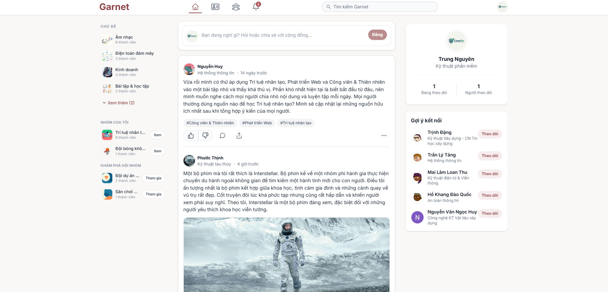
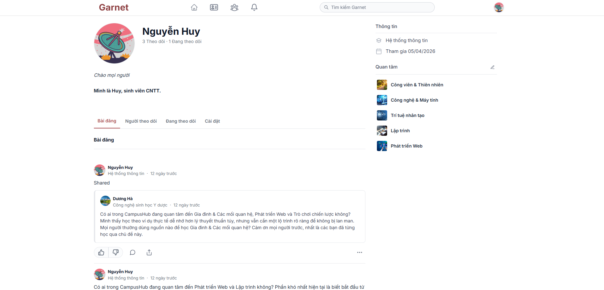
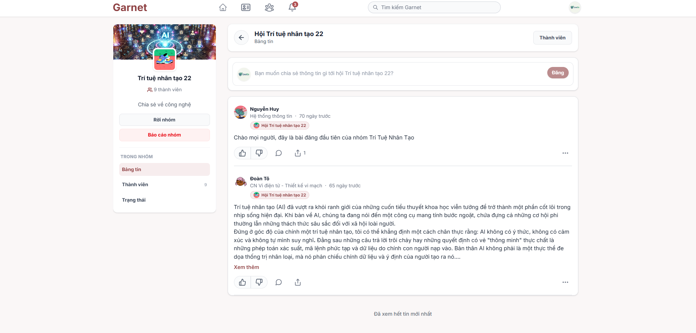
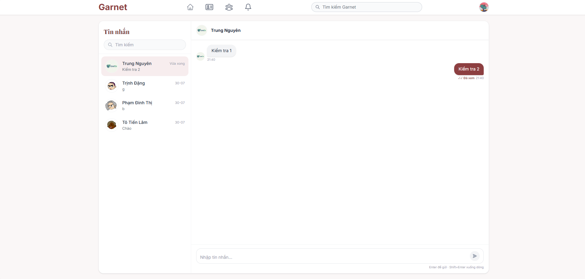
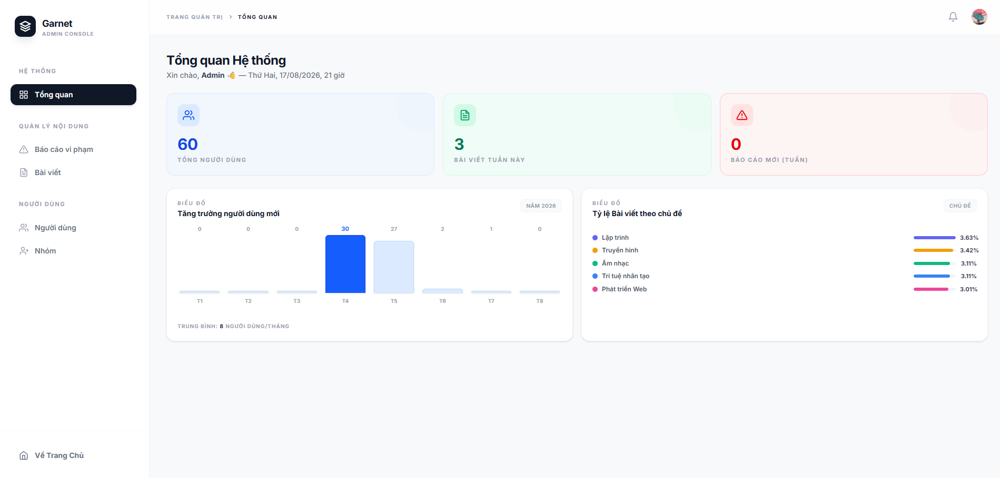
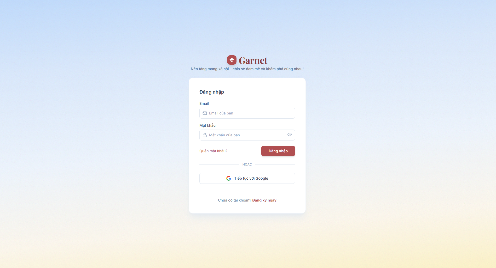

<div align="center">

# Garnet - Frontend

**Mạng xã hội học thuật dành cho sinh viên**

Garnet là nền tảng kết nối sinh viên, nơi chia sẻ kiến thức, thảo luận học thuật và xây dựng cộng đồng đại học.

[](https://react.dev/)
[](https://vitejs.dev/)
[](https://tailwindcss.com/)
[](https://reactrouter.com/)
[](https://vercel.com/)

</div>

---

## 🎯 Giới thiệu

**Garnet** là một mạng xã hội học thuật được xây dựng dành riêng cho sinh viên. Ứng dụng cho phép người dùng:

- 📝 Đăng bài, chia sẻ kiến thức và thảo luận theo chủ đề
- 👥 Kết nối với bạn bè và theo dõi những người dùng khác
- 🏠 Tham gia các **Spaces** (nhóm cộng đồng) theo lĩnh vực học tập
- 💬 Nhắn tin real-time qua WebSocket
- 🔔 Nhận thông báo theo thời gian thực
- 🛡️ Hệ thống Admin để quản lý nội dung và người dùng

---

## ✨ Tính năng nổi bật

| Tính năng | Mô tả |
|---|---|
| 🔐 **Xác thực** | Đăng ký, đăng nhập, quên mật khẩu, **Google OAuth2** |
| 🏠 **News Feed** | Xem bài đăng từ mạng lưới theo dõi (Home & Following) |
| ✍️ **Tạo bài đăng** | Soạn bài có đính kèm hình ảnh, video và hashtag |
| 🏘️ **Spaces** | Tạo và tham gia cộng đồng theo chủ đề |
| 💬 **Chat** | Nhắn tin trực tiếp real-time qua STOMP/WebSocket |
| 🔔 **Thông báo** | Thông báo real-time khi có tương tác mới |
| 👤 **Hồ sơ cá nhân** | Chỉnh sửa thông tin, ảnh đại diện, theo dõi/bỏ theo dõi |
| 🔖 **Topics** | Khám phá nội dung theo hashtag/chủ đề |
| 🛡️ **Admin Panel** | Dashboard, quản lý người dùng, bài đăng, báo cáo vi phạm |

---

## 🛠️ Tech Stack

### Frontend Core
| Công nghệ | Phiên bản | Mục đích |
|---|---|---|
| [React](https://react.dev/) | 19 | UI Library |
| [Vite](https://vitejs.dev/) | 8 | Build Tool & Dev Server |
| [React Router DOM](https://reactrouter.com/) | 7 | Client-side Routing |
| [TailwindCSS](https://tailwindcss.com/) | 4 | Utility-first CSS Framework |

### Real-time & Communication
| Công nghệ | Phiên bản | Mục đích |
|---|---|---|
| [@stomp/stompjs](https://stomp-js.github.io/) | 7 | STOMP over WebSocket |
| [sockjs-client](https://github.com/sockjs/sockjs-client) | 1.6 | WebSocket fallback transport |

### UI & UX
| Công nghệ | Phiên bản | Mục đích |
|---|---|---|
| [Sonner](https://sonner.emilkowal.ski/) | 2 | Toast notifications |
| [DOMPurify](https://github.com/cure53/DOMPurify) | 3 | XSS sanitization cho rich text |

### DevOps & Deployment
| Công nghệ | Mục đích |
|---|---|
| [Vercel](https://vercel.com/) | Hosting & Deployment |
| [ESLint](https://eslint.org/) | Code linting |

---

## 📂 Cấu trúc dự án

```
fr_campushub/
├── public/                     # Static assets
├── src/
│   ├── assets/                 # Hình ảnh, icons, fonts
│   ├── components/             # Shared/reusable components
│   │   ├── ProtectedRoute.jsx
│   │   └── AdminProtectedRoute.jsx
│   ├── context/                # React Context (Global State)
│   │   ├── AuthContext.jsx     # Quản lý trạng thái xác thực
│   │   └── WebSocketContext.jsx# Quản lý kết nối WebSocket
│   ├── features/               # Feature-based modules
│   │   ├── admin/              # Admin dashboard & management
│   │   ├── auth/               # Xác thực (login, register, OAuth2)
│   │   ├── chat/               # Nhắn tin real-time
│   │   ├── following/          # Feed bài đăng đang theo dõi
│   │   ├── home/               # News feed chính
│   │   ├── notification/       # Thông báo
│   │   ├── post/               # Bài đăng & bình luận
│   │   ├── profile/            # Hồ sơ người dùng
│   │   ├── space/              # Cộng đồng/Spaces
│   │   ├── topic/              # Chủ đề/Hashtag
│   │   └── user/               # Trang người dùng khác
│   ├── hooks/                  # Custom React Hooks
│   ├── layouts/                # Layout wrappers
│   │   ├── AuthLayout.jsx
│   │   ├── MainLayout.jsx
│   │   └── AdminLayout.jsx
│   ├── pages/                  # Route-level page components
│   ├── services/               # API call functions
│   │   ├── postService.js
│   │   ├── mediaService.js
│   │   └── authContextService.js
│   ├── utils/                  # Helper utilities
│   ├── App.jsx                 # Root component & routing
│   └── main.jsx                # Entry point
├── docs/                       # Tài liệu dự án
├── .env                        # Biến môi trường (không commit)
├── .env.example                # Template biến môi trường
├── vercel.json                 # Cấu hình deploy Vercel
├── vite.config.js
└── package.json
```

---

## 🖼️ Giao diện

### Trang chủ (Home Feed)


### Hồ sơ cá nhân


### Trang Spaces


### Chat Real-time


### Admin Dashboard


### Đăng nhập & Đăng ký


---

## 🚀 Cài đặt và chạy local

### Yêu cầu hệ thống

- **Node.js** >= 18.0.0
- **npm** >= 9.0.0 hoặc **yarn** >= 1.22.0
- **Backend API** đang chạy tại `http://localhost:8080` (xem repo backend)

### Bước 1: Clone repository

```bash
git clone https://github.com/<your-username>/garnet.git
cd garnet
```

### Bước 2: Cài đặt dependencies

```bash
npm install
```

### Bước 3: Cấu hình biến môi trường

Tạo file `.env` từ template:

```bash
cp .env.example .env
```

Chỉnh sửa file `.env` với các giá trị phù hợp (xem phần [Biến môi trường](#-biến-môi-trường)).

### Bước 4: Chạy development server

```bash
npm run dev
```

Ứng dụng sẽ khởi động tại **http://localhost:5173**

---

## 🔐 Biến môi trường

Tạo file `.env` ở thư mục gốc với nội dung sau:

```env
# URL của Backend API
VITE_API_URL=http://localhost:8080

# URI callback sau khi đăng nhập bằng Google OAuth2
VITE_OAUTH2_REDIRECT_URI=/oauth2/callback/google

# Key lưu token trong localStorage
VITE_TOKEN_KEY=garnet_token

# URL kết nối WebSocket
VITE_WS_URL=http://localhost:8080/ws
```

> ⚠️ **Lưu ý:** Không commit file `.env` lên repository. File này đã được thêm vào `.gitignore`.

---

## 📜 Scripts

| Lệnh | Mô tả |
|---|---|
| `npm run dev` | Chạy development server với Hot Module Replacement |
| `npm run build` | Build production bundle vào thư mục `dist/` |
| `npm run preview` | Preview bản build production trên local |
| `npm run lint` | Kiểm tra lỗi với ESLint |

---

## Liên kết

- [Backend repository](https://github.com/ngochuytech/Garnet)
- [Recommendation service repository](https://github.com/ngochuytech/Garnet_PostRecommendation)
